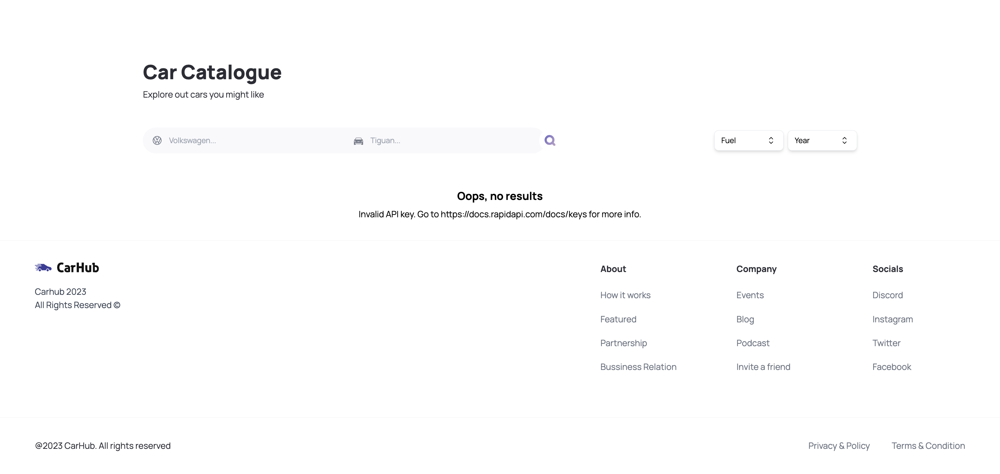

# Next.js Rental Service Project

This project is developed by Ramon Valentin. Explore more projects on [Ramon's GitHub](https://github.com/RamonvCS).

This is a [Next.js](https://nextjs.org/) project bootstrapped with [`create-next-app`](https://github.com/vercel/next.js/tree/canary/packages/create-next-app), designed to create an efficient and user-friendly rental service platform.


## Screenshots

### Landing Page


### Second Page


## Features

- **Responsive Design**: Ensures the platform is accessible and functional across all devices.
- **Modern UI/UX**: Designed with a clean and intuitive interface to enhance user experience.
- **Fast Performance**: Utilizes Next.js's built-in optimizations for fast loading times.
- **Server-Side Rendering (SSR)**: Improves SEO and initial page load time.
- **API Routes**: Built-in API routes to handle backend functionality.

## Technologies Used

- **Next.js**: A React framework that enables several extra features, including server-side rendering and generating static websites.
- **React**: A JavaScript library for building user interfaces.
- **Tailwind CSS**: A utility-first CSS framework for rapid UI development.
- **TypeScript****: A superset of JavaScript that adds static types.
- **Vercel**: Hosting platform for front-end frameworks and static sites, built to integrate with your headless content, commerce, or database.

## Getting Started

First, run the development server:

```bash
npm run dev
# or
yarn dev
# or
pnpm dev
# or
bun dev


git clone https://github.com/RamonvCS/Nextjs_Rental_Service.git

cd Nextjs_Rental_Service

npm run dev
# or
yarn dev
# or
pnpm dev
# or
bun dev


Deployment
The easiest way to deploy your Next.js app is to use Vercel, from the creators of Next.js.

Create a Vercel account if you don't have one.
Connect your GitHub repository on Vercel.
Deploy the project directly from Vercel's dashboard.
Contributing
Contributions are welcome! Please fork this repository and submit a pull request for any improvements.

Contact
For any inquiries or issues, please contact Ramon Valentin at Ramon's GitHub.

